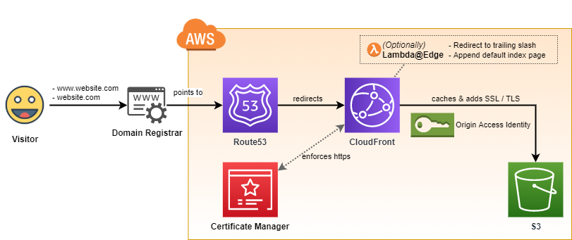
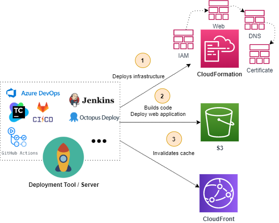
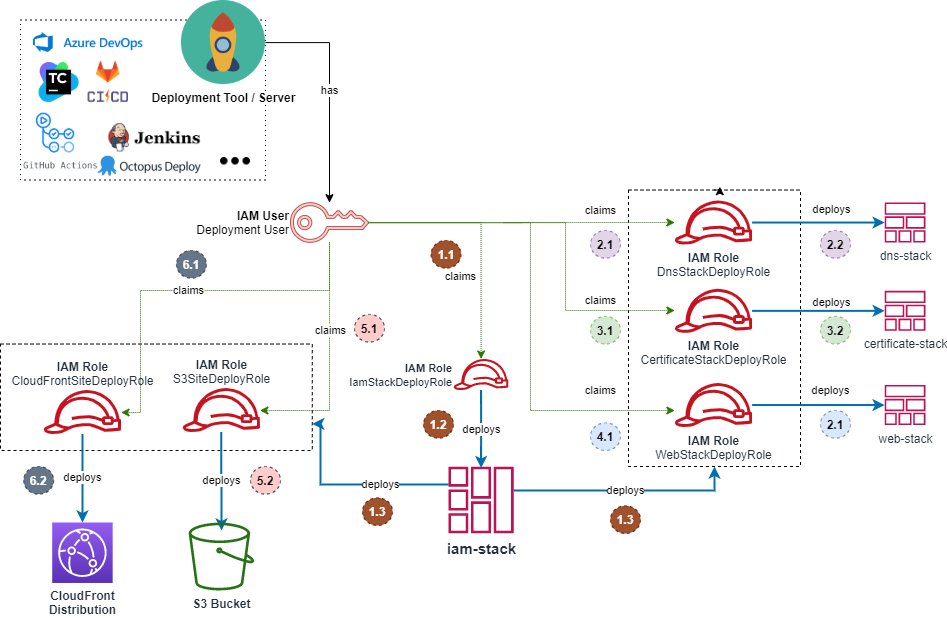

# aws-static-site-with-cd

> 🚀 Automatically deploy static websites to AWS using a deploy agent

[](https://github.com/undergroundwires/aws-static-site-with-cd/issues)
[](./.github/workflows/quality-checks.yaml)
[](./.github/workflows/security-checks.yaml)
[](./.github/workflows/bump-version-and-release.yaml)
[](https://github.com/undergroundwires/bump-everywhere)

- Cheap, secure and fully automated solution to handle your static website deployment to AWS.
- Using [step-by-step guide](#step-by-step-guide) in minutes you can:
  - create infrastructure for a static website
  - automate deployments from scratch.

## Why

This setup has different goals that makes difference from other static website setups:

- 🛡️ **Security first**: Least-privilege principle applied using paranoid granularity. See [architecture | security](#security).
- 🤖 **Automate everything**: Enables continuous delivery & integration using a deploy agent. Maintenance-free, scales forever. See [reference pipeline](./pipelines/github.yaml).
- 💰 **Cost-optimized**: Components are pre-configured to optimise costs, for more strategies see [cost optimizations](#cost-optimizations).   - I personally host a few sites using this solution and pay around 0.3$ per site.
- ⚙️ **Ready-to-configurations for static website requirements**
  - [Redirect to trailing slashes and default directory indexes using Lambda@Edge](#default-directory-indexes)
  - [Use deep-links with single page applications with own router e.g. Angular/Vue/React.](#web-stack)
  - [Use default 404 page](#web-stack)
  - [CORS to itself](#cors) to support e.g. ES6 modules

## Get started

- [Step-by-step guide](#step-by-step-guide)
- [Architecture](#architecture)
  - [Building blocks](#building-blocks)
  - [Optimizing costs](#cost-optimizations)
  - [Security](#security)
  - [CloudFormation](#cloudformation)
  - [Deployment scripts](#deployment-scripts)
  - [Extending](#extending)
- [Examples](#examples)

## Step-by-step guide
  
❗ **Prerequisite**: A registered domain name for website, can be Route53 or somewhere else.

### Manual deployment

***❗ Not recommended. You can skip directly to [automated deployment](#setting-up-automatic-deployments)***

1. Deploy infrastructure
   1. Deploy `dns-stack.yaml`.
   2. [Configure custom domain registrar](#configure-your-domain-registrar)
   3. Deploy `certificate-stack.yaml`
      - Must be in  `us-east-1` [see certificate stack](#certificate-stack)
      - Watch the status [here](https://console.aws.amazon.com/acm/home?region=us-east-1#/)
   4. Deploy `web-stack.yaml`
2. Deploy application
   - Copy your site to S3 and invalidate CloudFront cache
   - 💡 You can call [scripts](#deployment-scripts) to do that.

[↑](#get-started)

### Setting up automatic deployments

Estimated time: ☕ 10 min

1. [Deploy IAM stack](#deploy-iam-stack)
2. [Run your first build pipeline](#run-your-first-build-pipeline)
3. [Configure your domain registrar](#configure-your-domain-registrar)

#### Deploy IAM stack

- For the first time, you'll deploy IAM stack by a user you already own.
  - After initial deployment, you'll no longer need to use another user.
  - The stack will give you a deploy user and different roles it can claim.
- It'll give permissions to deploy the rest of the stack to the user.

##### Deploy IAM stack using console

1. Go to [Cloud Formation home](https://console.aws.amazon.com/cloudformation/home)
2. Click on "Create stack"
3. Select "Upload a template file"
4. Upload [`iam-stack.yaml`](./stacks/iam-stack.yaml)
5. Choose a name for your stack, see [choosing a name](#choosing-a-name)

##### Choosing a name

- Here you'll choose the name for your stack(s)
- 💡 Recommended: Have a prefix for each stack e.g. `websitename-iam-stack`, `websitename-cert-stack`...
- ❗ Double check to ensure you have max `18` chars [^1] (`28` without `iam-stack-` prefix) in your stack name.
  - Otherwise AWS trims the name, and it breaks some policies that gives permissions by the stack name, see [security](#security)
- Update also names for future stacks in `Parameters`.

[^1]: `64 chars for roles - 14 chars used by AWS - 21 chars longest role name (ResolveCertLambdaRole) + 1 hypens = 28 chars`

[↑](#get-started)

#### Run your first build pipeline

1. [Configure your deploy agent](#configure-your-deploy-agent)
2. [Run the deployment](#run-the-deployment)

##### Configure your deploy agent

1. [Add the secrets](#add-the-secrets)
2. [Create your build pipeline](#create-your-build-pipeline)
3. [Run the deployment](#run-the-deployment)

###### Add the secrets

- Add IAM secret ID + key, using console:
  1. Go to [IAM users](https://console.aws.amazon.com/iam/home#/users)
  2. Find and click on user generated by [IAM stack](#iam-stack), should have name as `{stackName}-DeploymentUser-{id}`
  3. Go to "Security credentials" then click on "Create access key" for the user.
  4. Copy "Access Key ID" and save it as `AWS_DEPLOYMENT_USER_ACCESS_KEY_ID` secret
  5. Reveal and copy "Secret access key" and save it as `AWS_DEPLOYMENT_USER_SECRET_ACCESS_KEY` secret
- Add more secrets from from Outputs section of previous `iam-stack` stack, using console:
  1. Go to [Cloud Formation home](https://console.aws.amazon.com/cloudformation/home)
  2. Click on deployed IAM stack name
  3. Go to "Output" tab, and copy each value to secret name given in "Description" field

###### Create your build pipeline

- If you use GitHub Actions or Azure Pipelines, you can use the [predefined template](./pipelines/github.yaml) here. Otherwise, configure the steps given there in your build agent. It simply calls bash scripts in [scripts](#deployment-scripts) as would be pretty easy to port anywhere. Feel free to contribute your solution as pull request to [pipelines folder](./pipelines).
- Using the [predefined template](./pipelines/github.yaml) ↘
 - It deploys changes on each push to `master`. You might not want that, you can change the behavior in first lines.
 - In predefined template, you'll see `TODO:` comments stating where you should customize the steps. Update those! See reference for [a node application privacy.sexy here](https://github.com/undergroundwires/privacy.sexy/blob/master/.github/workflows/build-and-deploy.yaml).

##### Run the deployment

- If you use Route53 as your domain registrar, you've completed setting up the deployments!
- ❗ [Configure your domain registrar](#configure-your-domain-registrar).
 - **Web stack may fail** after DNS stack because you need to validate your domain.
   - Once validated, delete the failed stack in [CloudFormation](https://console.aws.amazon.com/cloudformation/home) & re-run your deployment pipeline.
 - 💡 You can watch certificate status on [ACM](https://console.aws.amazon.com/acm/home) after configuring your registrar.

[↑](#get-started)

### Configure your domain registrar

- If your domain registrar is not registered in Route 53
  - 🚶 Go to your domain registrar and change name servers to NS values
    - `dns-stack.yaml` outputs those in CloudFormation stack that can be found in [Cloud Formation home](https://console.aws.amazon.com/cloudformation/home)
    - Or you can find those in [Route53](https://console.aws.amazon.com/route53/home#hosted-zones)
- When nameservers of your domain updated, the certification will get validated automatically,
- If your domain registrar is already Route 53
  - Then the nameservers the certification will get validated automatically.
  - When you register a domain with Route 53, a hosted zone is already assigned and domain registration is updated to use those name servers.
  - However the stacks create a **new** hosted zone that it will manage.
    - So you'll manually update your NS values again through `Route53 -> Domains -> Registered domains -> Your domain`
- 🎉🥳 Your site should be deployed and ready now!
- ❗ To use e-mail for your domain you should add your MX records by [extending web template](#extending-records-to-use-e-mail)

[↑](#get-started)

## Architecture

- AWS serverless architecture automatically provisioned using [CloudFormation files](/stacks) and [deployment scripts](/scripts).
- Keeping highest security & automation and lowest AWS costs were the highest priorities of the design.

### Building blocks



- **S3**
  - Hosts the content.
  - The content is only revealed to CloudFront to reduce the bills & increase security
- **CloudFront**
  - Provides SSL/TLS layer in front of S3 as S3 static websites do not support it.
    - It also offers integration with AWS WAF, a web application firewall.
  - Caches S3 content using `CloudFront Origin Access Identity`.
  - Publicly accessible.
  - (Optional) uses **Lambda@Edge** for implementing [default directory indexes](#default-directory-indexes)
- **Certificate Manager**
  - Holds certification to be used with TLS communication
  - Uses a **lambda** for automating deployment of certificates, see [certificate-stack](#certificate-stack).
- **Route53**
  - Allows you to use custom domain.

[↑](#get-started)

### Automation



- The flow is basically: Deploy infrastructure ► Deploy web application ► Invalidate CloudFront Cache
- To see how to build a deployment pipeline check  [github.yaml](./pipelines/github.yaml)
  - It's a basic reference to show how to call different scripts to automate CloudFormation & web application deployment on any server & automation tool.
  - It uses GitOps approach where everything that's merged in the master goes directly to production.
- Check out [step-by-step guide](#step-by-step-guide) to get started.

[↑](#get-started)

### Cost optimizations

- **S3**
  - Website uses cheapest S3 class level (`ONEZONE_IA`).
    - Lower availability as it only exists in single available zone.
  - It may not be the cheapest option if you update your content too frequently as you pay for `30 days` of data storage for any data that you put there.
  - 💡 If you update your content frequently, or want high availability, consider upgrading to `STANDARD`.
- **CloudFront**
  - The website uses cheapest CloudFront distribution.
    - If you have too much traffic it may be beneficial to increase the cache locations.
      - See [web-stack](#web-stack)
  - The deployment script invalidates CloudFront cache on every deploy.
    - It ensures that your site will serve the latest files.
    - Invalidation requests for first 1000 files each month are free, it costs $0.005 for invalidating each additional file.
    - Validating on each deploy would work perfectly with low to nothing costs for most of the cases.
    - 💡 You may want to change your cache strategy if you deploy more than 100 - 1000 a day, or deploy more than hundreds of files every day.
  - **Lambda@Edge**
    - Optionally deployed only if you need the functionality.
    - Uses the lowest memory settings as it does not need any memory
    - It timeouts in 3 seconds which should never be reached anyway

[↑](#get-started)

### Security

#### Infrastructure security

- S3 is not publicly available.
  - Have a very strict CORS policy that only allows the website itself, see [CORS](#cors)
- Only CloudFront can read it using `CloudFront Origin Access Identity`.
  - CloudFront can only `s3:GetObject`
    - It's essential for it to be able to read any webpage.
  - `s3:ListBucket` is required for right `404` status code, otherwise S3 returns `403`.
    - However we don't need to give `s3:ListBucket` to CloudFront as we just host a static website, we can assume `403` as `404` for functionalities such as [deep links and default 404 page](#web-stack).
- `CloudFront` redirects HTTP to HTTP(s), enforcing secure connection.
- `CloudFront` uses `TLS v1.2` as SSL/TLS protocol. You can choose to change to weaker (`TLS v1.1`) if you want to support legacy clients but offer less security. Never go lower than `TLS 1.1`

[↑](#get-started)

#### Deployment security

- Single deploy user claims different role per deploy step, `iam-stack` sets the limits and gives least permissions to the each role.
- All stacks use prefix-based role & access management based on the name of the stack.
- Any information about the account that's not known in CloudFormation is regarded as sensitive and are masked.

[↑](#get-started)

#### DevSecOps

Any pull request or push to this repository is automatically [linted for potential errors](./.github/workflows/quality-checks.yaml) and also [scanned for vulnerabilities](./.github/workflows/security-checks.yaml).

Vulnerability scans runs also periodically each month to check against latest known vulnerabilities.

[↑](#get-started)

### CloudFormation

- AWS infrastructure is defined as code in four different layers
- Cross stacks pattern is chosen instead of single stack or nested stacks because:
  - Easier to test & maintain & smaller files and different lifecycles for different areas.
  - It allows to deploy web bucket in different region than others as other stacks are global (`us-east-1`) resources.
- All stacks will tag their resources using `RootDomainName` parameter.

[↑](#get-started)

#### iam-stack

- Creates & updates the deployment user.
- Each deployment step has its own temporary credentials with own permissions.
- Everything in IAM layer is fine-grained using least privileges principle.



[↑](#get-started)

#### certificate-stack

- It'll generate SSL certification for the root domain and www subdomain.
- ❗ It [must](https://aws.amazon.com/premiumsupport/knowledge-center/cloudfront-invalid-viewer-certificate/) be deployed in `us-east-1` to be able to be used by CloudFront by `web-stack`.
- It uses CustomResource and a lambda instead of native `AWS::CertificateManager::Certificate` because:
  - Problem:
    - AWS variant waits until a certificate is validated.
    - There's no way to automate validation without workaround.
  - Solution:
    - Deploy a lambda that deploys the certificate (so we don't wait until certificate is validated)
    - Get DNS records to be used in validation & export it to be used later.

[↑](#get-started)

#### dns-stack

- It'll deploy Route53 hosted zone
- Each time Route53 hosted zone is re-created it's required to update the DNS records in the domain registrar.
  - See [Configure your domain registrar](#configure-your-domain-registrar)
- This stack does the most minimal job, it's isolated to minimize updates & possible failures with it.
  - Hopefully you'll never need to recreate this stack.
  - As each update requires you to wait for DNS propogation of the domain.
  
[↑](#get-started)

#### web-stack

- ❗ Prerequisite: [configure your domain registrar](#configure-your-domain-registrar)
- It'll deploy S3 bucket and CloudFront in front of it.
- It'll register:
  - IPv4 `A` records for root domain and `www` subdomain
  - IPv6 `AAAA` records for root domain and `www` subdomain.
  - It's defaulted to cheapest `PriceClass_100`, for other allowed values check [AWS documentation](https://docs.aws.amazon.com/AWSCloudFormation/latest/UserGuide/aws-properties-cloudfront-distribution-distributionconfig.html#cfn-cloudfront-distribution-distributionconfig-priceclass).
- Parameters:

  - **`UseIndexHtmlRewriteLambda`**
    - **Allowed Values :** `true`, `false`
    - **Default Value :**  `true`
    - **Description :** Enables [default directory indexing](#default-directory-indexes)
  - **`UseDeepLinks`**
    - **Allowed Values :** `true`, `false`
    - **Default Value :**  `false`
    - **Description :** Useful for Single Page Applications with own router, e.g. `Angular`, `Vue`, `React`
      - ❗ Does not work with `404Page`
  - **`404Page`**
    - **Allowed Values :** path to file, e.g. `./404.html`
    - **Default Value :**  -
    - **Description :** Tells CloudFront which page to return when the object in S3 does not exist.
      - ❗ Does not work with `UseDeepLinks`
  - **`CloudFrontPriceClass`**
    - **Allowed Values :** `PriceClass_100`, `PriceClass_200`, `PriceClass_All`
    - **Default Value :** `PriceClass_100`
    - **Description :** Overwrite CloudFront distribution price class.
      - See also [cost optimizations](#cost-optimizations)
  - **`MinimumProtocolVersion`**
    - **Allowed Values :** `TLSv1`, `TLSv1.1_2016`, `TLSv1_2016`, `TLSv1.2_2018`
    - **Default Value :** `TLSv1.2_2018`
    - **Description :** `TLSv1.2_2018` is recommended for the highest security.
      - You can use lower version if your viewers are using browsers or devices that don’t support TLSv1.2.
      - See also [infrastructure security](#infrastructure-security)

[↑](#get-started)

##### Default directory indexes

- **Problem**
  - CloudFront can redirect  `test.com` to `test.com/index.html`
    - 4 it does not work on subfolders e.g. `test.com/hello/` to `test.com/hello/index.html`
  - AWS static websites can redirect `test.com/folder/` to `test.com/folder.html`
    - However it does not work with HTTPS, and only support HTTP.
    - We don't want bucket to be publicly accessible, and HTTP does not work with `CloudFront Origin Access Identity`
    - Instead we must use AWS REST endpoint to be able to use `CloudFront Origin Access Identity`.
      - But it does not support redirection to a default index page.
  - So user must enter `test.com/folder/index.html` because `test.com/folder/` won't work!
- **Solution**
  - Deploy Lambda@Edge that'll run where the edge CloudFront node runs to serve S3 content.
    - It redirects requests without '/' to links with trailing '/'
      - e.g. `test.com/folder` to `test.com/folder/`
    - It creates new URL by replacing any '/' that occurs at the end of a URI with `index.html`.
      - e.g. `test.com/folder` to `test.com/folder/index.html`.
  - 💰 It's almost free. [AWS Pricing](https://aws.amazon.com/lambda/pricing/):
    - $0.60 per 1 million requests ($0.0000006 per request)
    - $0.00000625125 for every 128MB-second
    - So its around ≈ $0,00000685125 per request which makes **≈ 0,68 USD per 100.000 request**
    - And the function executes **only** when CloudFront forwards a new request to S3 bucket
      - If the requested object is in the edge cache, the function doesn't execute.

[↑](#get-started)

##### CORS

When you import modules such as :

```html
<script src="/exporter.js" type="module" ></script>
<script type="module">
import * as imported from "./exporter.js";
</script>
```

It'll make a CORS request to function. So S3 only allows the website itself to do CORS requests to ensure maximum security.

[↑](#get-started)

### Deployment scripts

- ❗ Prerequisite: [AWS CLI v2](https://docs.aws.amazon.com/cli/latest/userguide/install-cliv2.html)
- Scripts:
  - `configure/create-user-profile.sh`: Creates AWS profile for the build user.
  - `deploy/deploy-stack.sh`: validates & deploys given CloudFormation stack.
  - `deploy/deploy-to-s3.sh`: Synchronizes given folder with the given S3 bucket using given storage class.
  - `deploy/invalidate-cloudfront-cache.sh`: Invalidates cache on root level so the site is up again.
- Best way to see their usage in a build pipeline is checking out the [reference pipeline](./pipelines/github.yaml).

[↑](#get-started)

#### Signing sessions

- Using `--session` parameter you can sign each role claim with useful information for auditing through e.g. CloudTrail.
  - It gives helpful insight for why a role is claimed during deploy.
- Example using GitHub pre-defined variables: `--session ${{github.actor}}-${{github.event_name}}-${{github.sha}}`

[↑](#get-started)

### Extending

You can always copy the stacks and modify, however then you miss the updates. There's one more way to extend to templates and always keeping up-to-date easily:

1. Name your stack as such: `yourexistingwebstackname-extend`
   - You must start with existing stack name as it'll then be granted permissions by IAM-stack.
   - You must then add `-extend` suffix as it's the only suffix allowed in IAM-stack.
2. Write your logic, feel free to use exported variables from other stacks
3. Deploy using the same role that deploys the extended stack
   - E.g. if you are extending `web-stack` you then use `AWS_WEB_STACK_DEPLOYMENT_ROLE_ARN` secret to claim the role.

❗ It's only WEB stack that's allowed to extend right now. Please create an issue if you'd like to extend other stacks as well.

#### Extending records to use e-mail

- Create a yaml file like `dns-records.yaml`
- Add the DNS records:

  ```yaml
    AWSTemplateFormatVersion: '2010-09-09'

    Description: Extend DNS records with e-mail to be able to receive emails

    Parameters:
      DnsStackName:
        Type: String
        Description: Name of the DNS stack.
      RootDomainName:
        Type: String
        Description: The root DNS name of the website e.g. cloudarchitecture.io
        AllowedPattern: (?!-)[a-zA-Z0-9-.]{1,63}(?<!-)
        ConstraintDescription: Must be a valid root domain name

    Resources:
      EmailDNSRecords:
        Type: AWS::Route53::RecordSet
        Properties: 
          Comment: "MX records for Gandi to recieve e-mails"
          HostedZoneId:
            Fn::ImportValue: !Join [':', [!Ref DnsStackName, DNSHostedZoneId]]
          Name: !Ref RootDomainName
          Type: MX
          TTL: 10800
          ResourceRecords:
            - "10 spool.mail.gandi.net."
            - "50 fb.mail.gandi.net."
  ```
- Extend DNS records using a new deployment step e.g.

```yaml
    name: "Infrastructure: Deploy web stack (extend)"
    run: >-
      bash "scripts/deploy/deploy-stack.sh" \
        --template-file ../site/.infrastructure/dns-records.yaml \
        --stack-name undergroundwires-web-stack-extend \
        --parameter-overrides "DnsStackName=undergroundwires-dns-stack RootDomainName=undergroundwires.dev" \
        --region us-east-1 \
        --role-arn ${{secrets.AWS_WEB_STACK_DEPLOYMENT_ROLE_ARN}} \
        --profile user --session ${{ env.SESSION_NAME }}
    working-directory: aws
```


[↑](#get-started)

## Examples

- [https://privacy.sexy](https://privacy.sexy) | [repository](https://github.com/undergroundwires/privacy.sexy) | [github actions workflow](https://github.com/undergroundwires/privacy.sexy/blob/master/.github/workflows/deploy.yaml)
- [https://cloudarchitecture.io](https://cloudarchitecture.io) <!--| [repository](https://github.com/undergroundwires/cloudarchitecture.io) | [github actions workflow](https://github.com/undergroundwires/cloudarchitecture.io/blob/master/.github/workflows/build-and-deploy.yaml)-->
- [https://erkinekici.com](https://erkinekici.com) <!--| [repository](https://github.com/undergroundwires/erkinekici.com) | [github actions workflow](https://github.com/undergroundwires/erkinekici.com/blob/master/.github/workflows/build-and-deploy.yaml)-->
- Send a pull request to add your site here!

[↑](#get-started)
